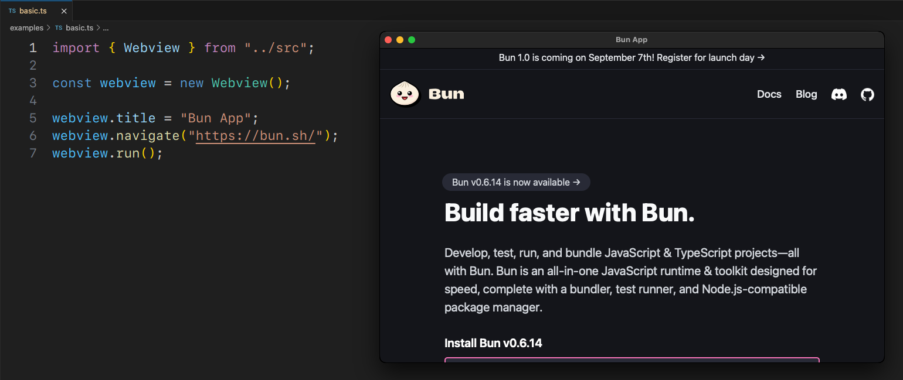

# webview-bun

[bun](https://bun.sh/) bindings for [webview](https://github.com/webview/webview/)

Webview is a tiny cross-platform library to make **web-based GUIs for desktop applications**.



## Installation

<details>
  <summary>Click here for instructions on 🐧 Linux</summary>
  The compiled linux library in this package requires GTK 4 and WebkitGTK 6.

> To use a different version, see Development section below.

- Debian-based systems: `apt install libgtk-4-1 libwebkitgtk-6.0-4`
- Arch-based systems: `yay -S gtk4 webkitgtk-6.0`
- Fedora-based systems: `dnf install gtk4 webkitgtk6.0`
</details>

<details>
  <summary>Click here for instructions on 🪟 Windows</summary>
  The compiled windows library in this package does not bundle any webview version with itself but rather uses the system installed one.

> To bundle a specific version, see Development section below.

The <a href="https://developer.microsoft.com/en-us/microsoft-edge/webview2/">Microsoft Edge WebView2</a> runtime is required to be installed on the system for any version of Windows before Windows 11.
To manually update or install the latest version, follow the steps <a href="https://github.com/MicrosoftEdge/WebView2Feedback/issues/3371#issuecomment-1500917825">here</a>.

</details>

```bash
bun i webview-bun
```

## Example

```typescript
import { Webview } from "webview-bun";

const html = `
<html>
    <body>
        <h1>Hello from bun v${Bun.version} !</h1>
    </body>
</html>
`;

const webview = new Webview();

webview.setHTML(html);
webview.run();
```

For more examples, browse the `examples` folder of this repository.

## Single-file executable

You can compile a single self-sufficient executable file for your webview app.

For example, let's create a single executable for the above To-Do app. Clone this repository and run,

```bash
bun build --compile --minify --sourcemap ./examples/todoapp/app.ts --outfile todoapp
```

> [!TIP]  
> By default, a terminal window will also open in the back when double-click opening the executable in Windows and macOS.
>
> #### 🪟 To hide it in Windows:
>
> Download [hidecmd.bat](https://github.com/tr1ckydev/webview-bun/blob/main/scripts/hidecmd.bat) from this repository and save in the same folder as the binary. Open terminal there and execute,
>
> ```bash
> .\hidecmd.bat todoapp.exe
> ```
>
> #### 🍎 To hide it in macOS:
>
> Add the extension `.app` in the end of the above bun build command.

### Cross-platform compilation

Bun now supports cross-compilation of single executable binaries. To cross compile your webview app for a different platform run,

```bash
bun build --compile --target=bun-windows-x64 --minify --sourcemap ./examples/todoapp/app.ts --outfile todoapp
```

See [full list](https://github.com/oven-sh/bun/blob/main/docs/bundler/executables.md#supported-targets) of supported `target`s.

### Bun.serve with webview

If you run a web server it will block the main thread, but using workers you can run the webview window on another thread.

[From Bun v1.1.25, you can now embed worker scripts in a standalone executable.](https://bun.sh/blog/bun-v1.1.25#worker-in-standalone-executables) Clone this repository then,

```bash
cd examples/webserver/
bun build --compile --minify --sourcemap ./index.ts ./worker.ts --outfile webserver
```

> [!NOTE]
>
> On macOS, this doesn't work due to some bug in bun as webview window doesn't open from a worker.

## Documentation

Refer to the comments in the source code for full documentation.

## Development

Please format all code with [Prettier](https://prettier.io/) and the root `.prettierrc`. You can run `bun pretty` to automatically do this if it is not integrated in your IDE.

> [!IMPORTANT]  
> If you are on **Windows,** you need C++ Build Tools.
>
> - Go to https://visualstudio.microsoft.com/downloads.
> - Scroll down > _All Downloads_ > _Tools for Visual Studio_.
> - Download _Build Tools for Visual Studio 2022_ and run.
> - Select _Desktop development with C++_ and install.

### Prerequisites

In addition to the dependencies mentioned during the Installation section, you need,

- `cmake`
- `ninja`
- `python3`

### Building

- Clone the repository along with the [webview](https://github.com/webview/webview) submodule.

  ```bash
  git clone --recurse-submodules https://github.com/tr1ckydev/webview-bun
  cd webview-bun
  bun i
  ```

- Build the library for your platform.

  > Under the hood, it invokes webview's own cmake build system to compile the shared library file.

  ```bash
  bun run build
  ```

- (Optional) Clear the build cache.

  ```bash
  bun clean
  ```

The compiled library file can be found inside the `build` folder.

### Customization

🐧 For linux, if you want to use a different WebkitGTK version, change the cmake `WEBVIEW_WEBKITGTK_API` option in _build.ts_ to one of the [available values](https://github.com/webview/webview?tab=readme-ov-file#linux-specific-options).

🪟 For windows, if you want to bundle a specific webview version instead of using the system installed one, set the cmake `WEBVIEW_MSWEBVIEW2_VERSION` option to one of the [NuGet version strings](https://www.nuget.org/packages/Microsoft.Web.WebView2/#versions-body-tab).

Check out the [webview build docs](https://github.com/webview/webview?tab=readme-ov-file#customization) for more options.

### Running

> [!TIP]
> To use your own webview library, set the `WEBVIEW_PATH` environment variable with the path to your webview shared library file.

Run the following example to see it in action.

```bash
bun run examples/basic.ts
```

For more examples, browse the `examples` folder of this repository.

## Credits

This repository is a port of [webview_deno](https://github.com/webview/webview_deno) with various changes to work with the bun runtime.

## License

This repository uses MIT license. See [LICENSE](https://github.com/tr1ckydev/webview-bun/blob/main/LICENSE) for full license text.
